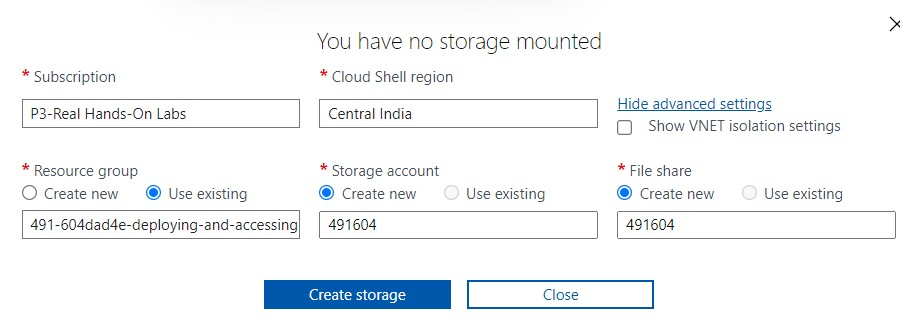

# <ins> Create K8s cluster on Azure and deploy a application </ins>

This document helps explaining how to deploy an application using Kubernetes via Azure.
The objective of this exercise is to undertsnd how CongifMaps and Secrets would work when we deploy an application using Kubernetes. 
### <ins> The first objective: </ins> 
  - Here we are deploying an image *eclipse-mosquitto:1.6.2* using a deployment.yaml file. We would also be changing the config file ```mosquitto/config/mosquitto.conf``` from the default one to the one what we have in our configmap.
### <ins> The second objective: </ins>
  - We are going to place the secret file we create and place it in the path ```mosquitto/secret```

### <ins>What we will be doing</ins>

### <ins>Create AKS Cluster</ins>

Create just the cluster, without any integrations with Azure Monitor, or Azure Policy.

For creating a cluster, storage has to be mounted. A message would be displayed as shown in the image below.


Upon clicking on advanced settings we would have to confgure storage/file share with a unique ID (In the example shown it's the first 6 alphanumeric places of the resource which I have physically entered.)



The cluster in this scenario was build using cli az commands.

```az group list```

```ResourceGroup=491-5aa87ef0-deploying-and-accessing-an-applicatio  #This would be the variable which consists the group name```

```az aks create --resource-group $ResourceGroup --name Cluster01 --node-count 3 --generate-ssh-keys --node-vm-size Standard_B2s --enable-managed-identity```

In order to connect to the cluster we need to run the kubectl commands we need to run the below command

```az aks get-credentials --name Cluster01 --resource-group $ResourceGroup```

Github Repo:
https://github.com/skaushikpowershell/DEMO
Run this command on cloudhsell (BASH)```ssh-keygen -t rsa -b 1024``` (Overwrite the existing keys) as they are not in openssh format. 
Add the public keys to github to get the server to clone/pull the code.

Do a gitclone to get the content in the git repo

``` git clone git@github.com:skaushikpowershell/DEMO.git ```

### <ins>Deploy the Application</ins>

Create a deployment to include one replica of the application. The deployment can be applied in the Azure Portal or with the Azure Cloud Shell.
The application should use the eclipse-mosquitto:1.6.2 image.
It is important that the config-file and the secret-file be deployed first so that the deployment.yaml file can relate to the configmaps and secrets which is being pointed to 

``` git clone git@github.com:skaushikpowershell/DEMO.git ```

```cd DEMO/mosquitto```

```kubectl apply -f config-file.yaml```
```kubectl get configmaps```

```kubectl apply -f secret-file.yaml```
```kubectl get secrets```

```kubectl apply -f mosquitto-vol.yaml```
```kubectl get pods```

### <ins>Access the Application to check</ins> 

In order to access the container to see the application, we can use 
``` kubectl exec -it mosquitto-5f79855884-2rw2w -- /bin/sh ```
Here we can check ```mosquitto/config/mosquitto.conf``` and ```mosquitto/secret```